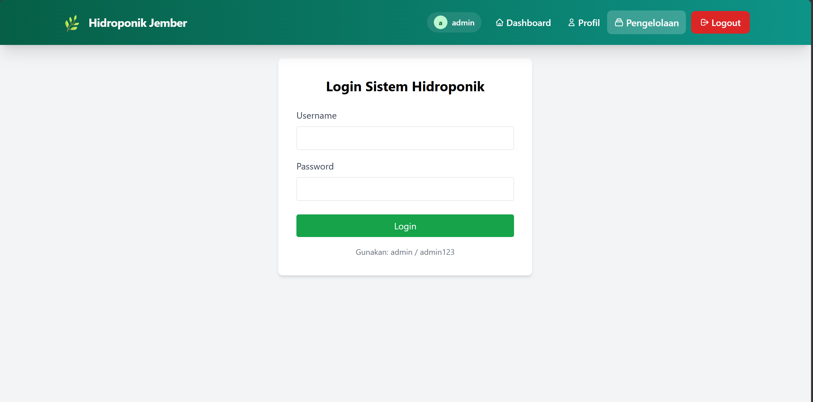
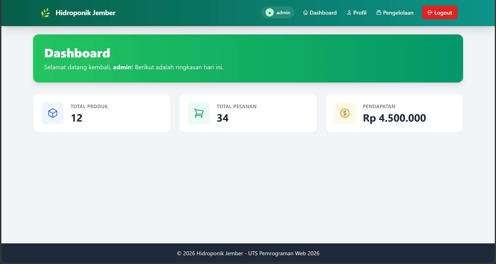
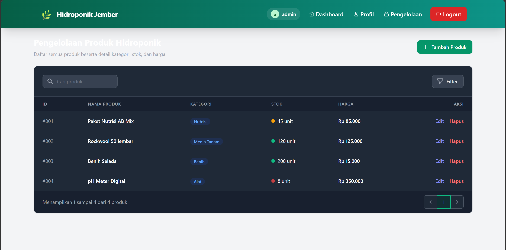
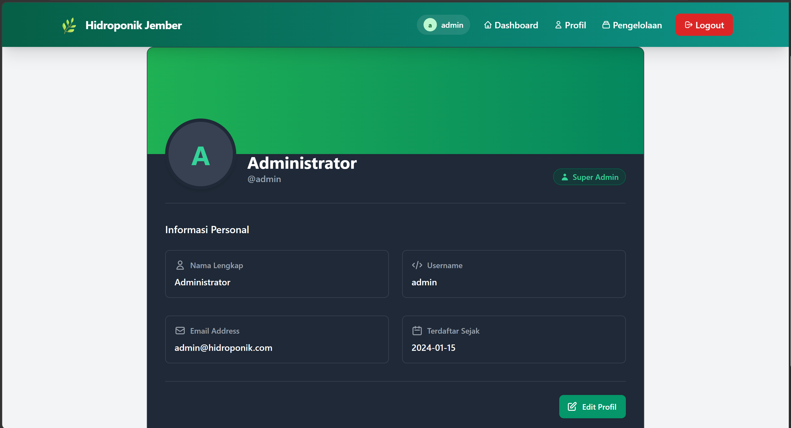

</> Sistem Manajemen Hidroponik WEB

WEB ini merupakan aplikasi berbasis Laravel Blade yang digunakan untuk mengelola sistem hidroponik, mencakup autentikasi pengguna, dashboard statistik, serta halaman profil user dengan tampilan modern menggunakan Tailwind CSS.

</> Fitur
Login System → autentikasi pengguna (username & password)
Dashboard → menampilkan ringkasan data (produk, pesanan, pendapatan)
Profil Pengguna → informasi lengkap akun user
Statistik Card → tampilan data dengan UI interaktif
Aktivitas Terbaru → log aktivitas sistem
Responsive Design → tampilan menyesuaikan HP & desktop
UI Modern → menggunakan Tailwind CSS (gradient, shadow, dll)
Blade Template → menggunakan layout layouts.app
Dynamic Data → data ditampilkan dari controller Laravel

</> Screenshot

</> Tools
Laravel (Blade Template Engine)
Tailwind CSS
PHP
VS Code
</> Struktur Folder
├── resources/views/
│   ├── layouts/
│   │   └── app.blade.php
│   ├── dashboard.blade.php
│   ├── login.blade.php
│   └── profile.blade.php
├── routes/web.php
├── app/Http/Controllers/
</> Fitur Halaman
Login
Form username & password
Validasi error login
Informasi akun default
Dashboard
Sapaan user (dynamic username)
Statistik:
Total Produk
Total Pesanan
Pendapatan
Aktivitas terbaru
Profil
Avatar dengan inisial
Informasi user:
Username
Email
Nama lengkap
Tanggal registrasi
Status akun (Aktif & Terverifikasi)
Tombol aksi (Edit Profil & Ubah Password)
</> Tujuan Project

Project ini dibuat untuk:

Melatih penggunaan Laravel Blade
Memahami konsep MVC (Model-View-Controller)
Meningkatkan kemampuan frontend (Tailwind CSS)
Membuat tampilan dashboard modern & interaktif
Sebagai portfolio project web developer